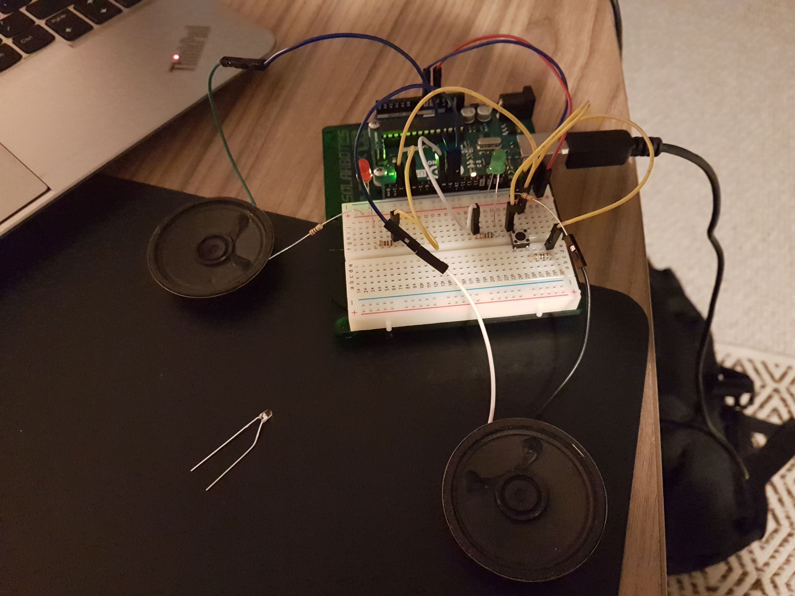
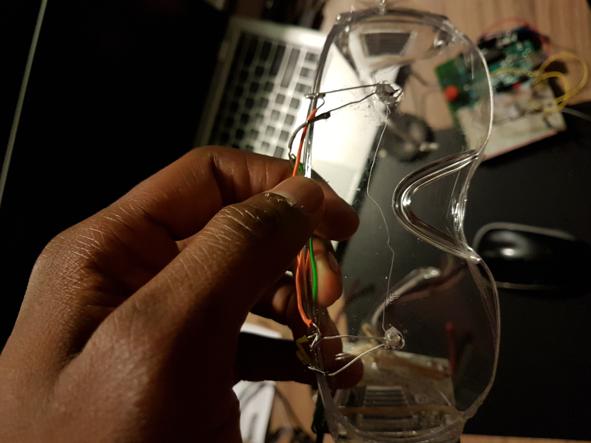
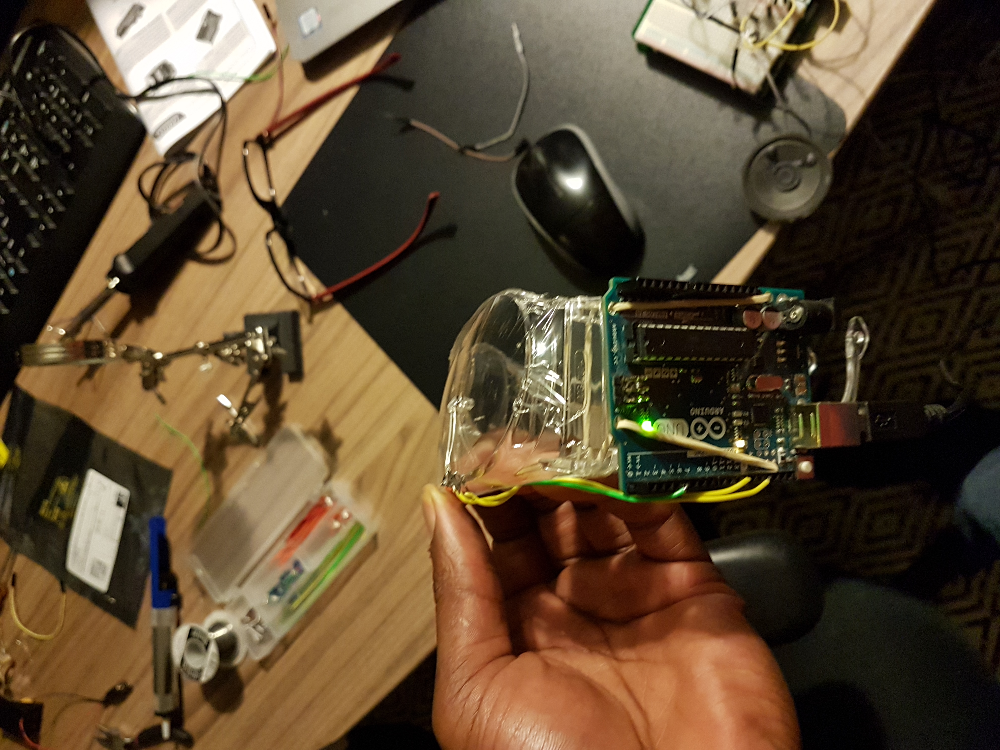
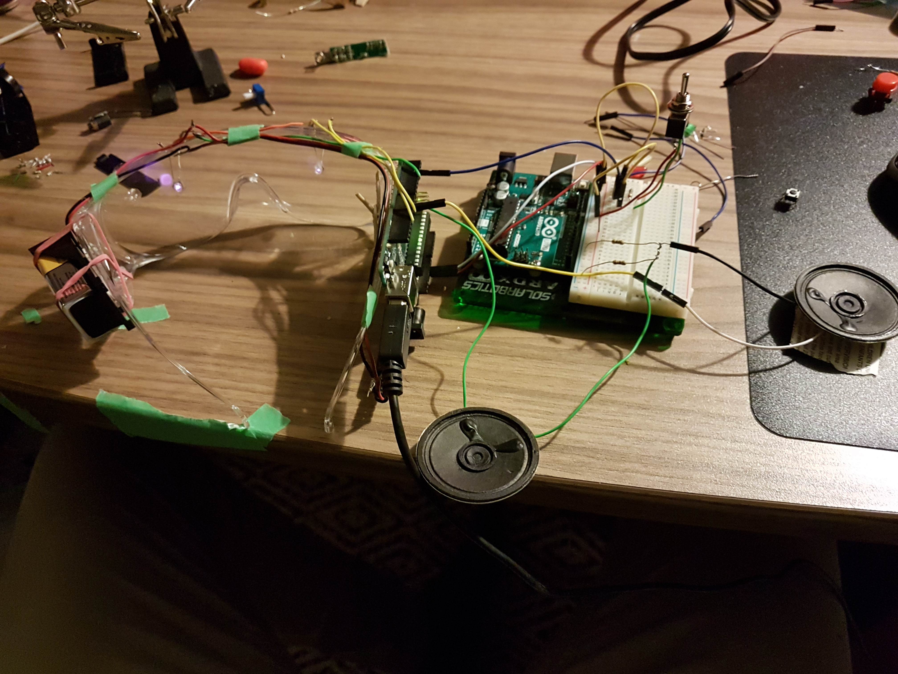
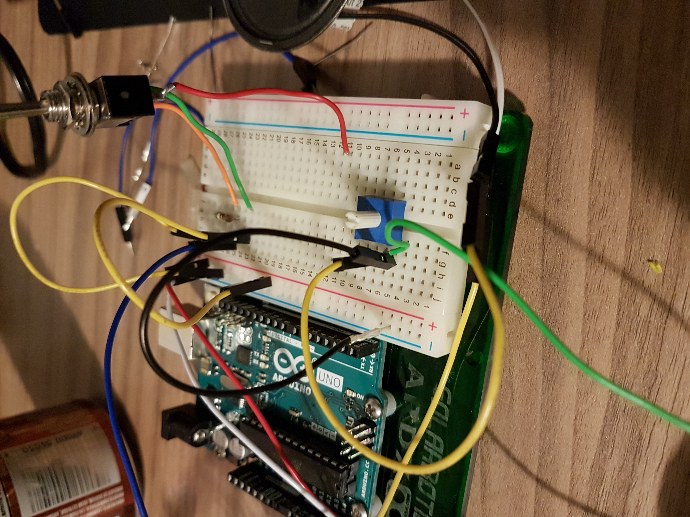
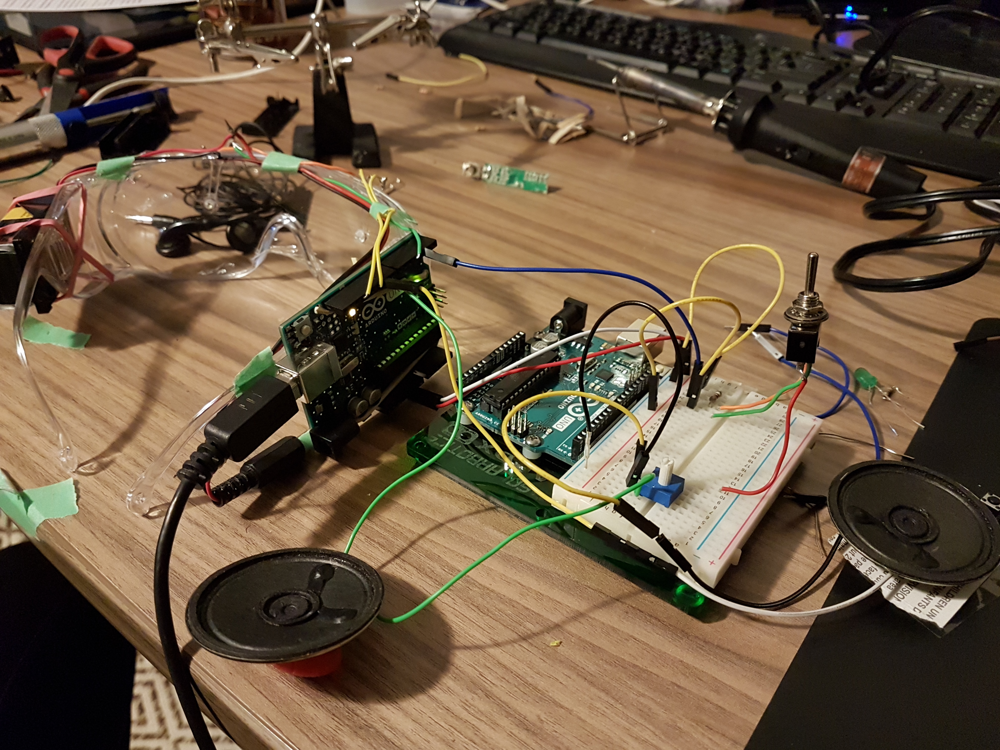
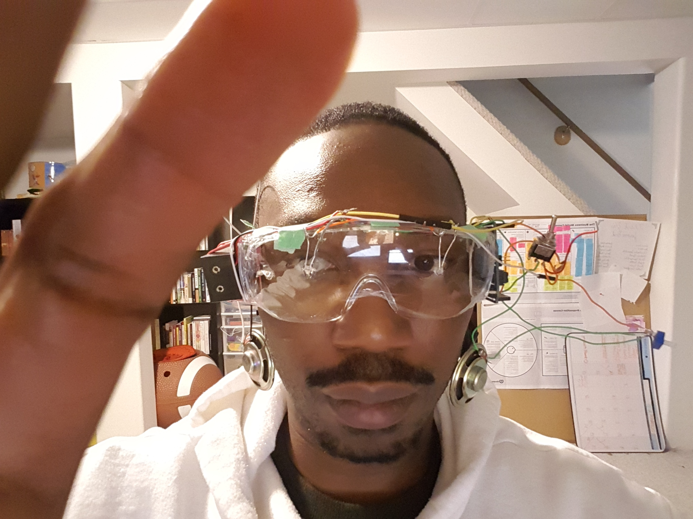
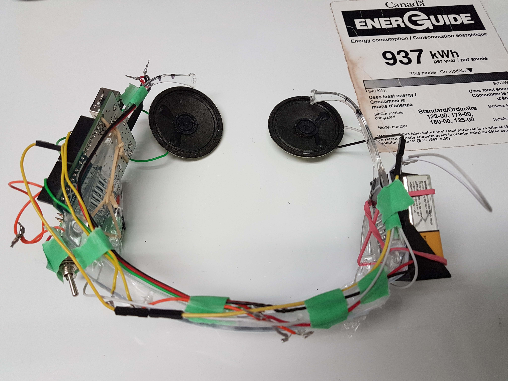

# CS207Project - Photo-NeuroFeedback Device V1.0
Project for CS 207 - building Interactive Gadgets

The aim of this Project is to develop a proof of concept Neurofeedback system, using a pre-existing hardware solution called the Brain Machine, a Sound Light Machine (SLM designed and built by a well known Hacker and Engineer named Mitch Altman. This device will satisfy the requirements of developing a novel neurofeedback system using Mitch’s SLM, which is claimed that “Wearing the glasses often induces colorful hallucinations while in use, a sense of relaxation afterwards and, are a fun 14 minute brain trip.” 

Since Mitch’s design uses regular LED lights shone through glasses, on the closed eye’s of the client, it seemed logical to experiment with the technology of PhotoBioModulation, using 810nm LED’s which are readily available (Costs $2.89 per LED), scientifically studied and medically tested, light frequency device  used to provide eye, brain and body stimulation. Along with a customized software program which will operate the LED’s in a method the Author calls Photo-NeuroFeedback.

# Repository Contents
* /Code - Original Code used to test hardware and new Neurofeedback protocol code
* /Final Write up - Project completion report
* /Ideas - Documentation of original builds and code, instruction manual
* /Parts - List of components used to build device
* /Pictures - images of build from inception to completion
* /Project Proposal - Initial Proposal for project build
* /Sources - Code, Studies, Research, Cited Material etc. 
* /Supporting Documentation - Project plan, Technical details

# Requirements and materials

## Architecture and Environment

A Sound Light Machine called the Brain Machine created by Mitch Altman will be used to achieve the desired technical requirements for the Neurofeedback system and will be programmed to using a simple Neurofeedback training protocol. This proof of concept Photo-Neurofeedback device replaces the LED’s in Mitch’s design, with a couple of 810nm LED’s. 
The LED’s will operate according to the requirements of a Neurofeedback device; which is a device that reads EEG and provides sensory data to the client in order to help the client attain a certain state of mind. 

This device will input data from EEG sensors, process the signal according to set parameters derived from a Neurofeedback training protocol and output the feedback delivering PMB to the clients via their Retina. The client’s response to this stimulus will then be stored as raw EEG data file. Eventually this data can be used to provide a client progress report, and graphing to develop further protocols. 

Code will be written on the Arduino IDE using the C/C++ programing language to run the LED’s. 

## Software

 The software will be a sketch designed on the Arduino IDE using the C/C++ programming languages

## Hardware

The arduino UNO board will be used test the system by collecting Brain Wave Data as well as providing Neurofeedback using the flashing lights. 

## Parts List

* 2 - 810 nm Infrared LED
* 2 - 8ohm speakers
* 1 - 10k ohm potentiometer
* 1 - 47 Ohm Resistor
* 1 - 2.2k Resistor
* 1 - toggle switch
* 1 - 9v batter
* 1- 9v battery holder with power plug
* 1 - Arduino Uno
* 1 - pair of Safety glasses
* wire

* 2 - Silver EEG Sensor leads and wires
* 1 -EEG amplifier 

## Tools
* Soldering Iron
* Solder
* Solder sucker
* Multimeter
* Flush Diagonal Cutters
* Drill
* Glue Gun
* Helping hands with Magnifying glass

# Build Instructions
## For PNFB Glasses

Read full Details in Completion report

### Schematic

* Build the speaker and LED circuit by using a bread board 

* Drill holes into safety glasses and insert LEDs, illuminated side pointing towards the eyes. 

* Connect Arduino to the arm of safetyglasses

* Test circuit on Breadboard by using Chris Sparnicht Code

* Add potentiometer (For Volume control) and Toggle switch (on/off)

* Integrate speakers and other components into the mounted arduino

* Test the circuit comfort by wearing and observing sound and light sequences

* Secure wiring using painters tape to ensure wires are not loose while wrapping

* Wrap surface using electrical tape for aesthetics

## Firmware Installation

* Ensure you change Pins in code to relevant Pins used on Arduino for Speakers, LEDs, Potentiometer and switch
* Use Arduino IDE to upload Brain machine code - Chris Sparnicht Code to Arduino Uno <https://github.com/damiegbeyemi/CS207Project/blob/master/Code/Brain%20machine%20code%20-%20Chris%20Sparnicht>

## EEG Amplifier

Read full Details in Completion report

### Schematic

* Connect components as shown above on a bread board schematic

* Add sensor wires to circuit between the ground and negative side of the capacitor

* Upload EEG acquisition code to Arduino
<https://github.com/damiegbeyemi/CS207Project/blob/master/Code/EEG%20Acquisition%20Code>

* Change pins in code to fit your build

* Use serial plotter to plot signal (Change baud rate as needed, in code and in serial plotter)

# Usage

1.	Sit in a comfortable position, preferably in a quiet room.
2.	Put on the device, as you would regular glasses.
3.	Close your eyes, and keep them closed for the entire length of the session (14 minutes).
4.	Turn on the device by flipping the toggle switch from the off position, to the on position.
5.	Relax and listen to the tones from the speakers, while the LEDs flash pulses of light through the eyelids.
6.	After 14 minutes the device automatically shuts off.
7.	Carefully take off the glasses.
8.	Turn the switch to the off position. 

# Project by
Dami Egbeyemi

# Credits

[1] C. Sparnicht, A Light and Sound Machine for the Arduino Uno. Contribute to LaughterOnWater/Arduino-Brain-Machine development by creating an account on GitHub. 2017. 

[2] PublicResourceOrg, BASIC AMPLIFIERS. [YouTube.com] . Available: https://www.youtube.com/watch?v=qSjgAzVGtbY [Accessed: 13-Dec-2018].

[3] ‘Brain Machine - TkkrLab’. [Online]. Available: https://tkkrlab.nl/wiki/Brain_Machine. [Accessed: 13-Dec-2018].

[4] ‘chipstein’. [Online]. Available: https://sites.google.com/site/chipstein/home. [Accessed: 23-Nov-2018].

[5] ‘HOW TO - Make the “Brain machine” | Make:’, Make: DIY Projects and Ideas for Makers, 13-Nov-2008. [Online]. Available: https://makezine.com/2008/11/13/the-Brain-machine/. [Accessed: 13-Dec-2018].

[6] J. C. Rojas and F. Gonzalez-Lima, ‘Low-level light therapy of the eye and Brain’, Eye Brain, vol. 3, pp. 49–67, Oct. 2011.

[7] ‘Overview | Brain Machine | Adafruit Learning System’. [Online]. Available: https://learn.adafruit.com/Brain-machine/overview. [Accessed: 13-Dec-2018].

[8] M. Hennessy and M. R. Hamblin, ‘Photobiomodulation and the Brain: a new paradigm’, J Opt, vol. 19, no. 1, p. 013003, Jan. 2017.

[9] N. C. for B. Information, U. S. N. L. of M. 8600 R. Pike, B. MD, and 20894 Usa, SUMMARY OF EVIDENCE. Canadian Agency for Drugs and Technologies in Health, 2014.

[10] ‘The Brain Machine!’ [Online]. Available: http://www.ladyada.net/make/Brain/. [Accessed: 13-Dec-2018].

[11] U. Strehl, ‘What learning theories can teach us in designing neurofeedback treatments’, Front Hum Neurosci, vol. 8, Nov. 2014.

[12] ‘Topics Map.jpg | Schoology’. [Online]. Available: https://app.schoology.com/course/1690671434/materials/gp/1762615894. [Accessed: 13-Dec-2018].
